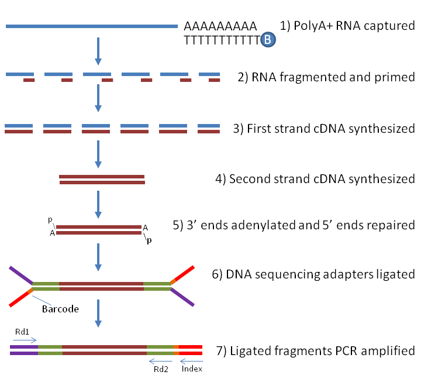
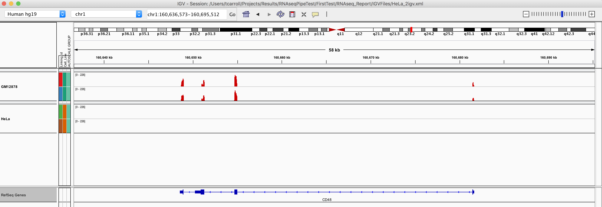
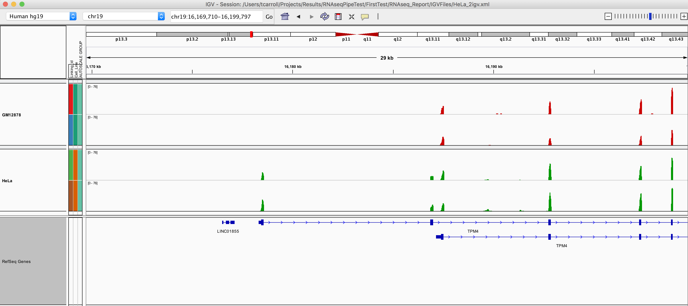
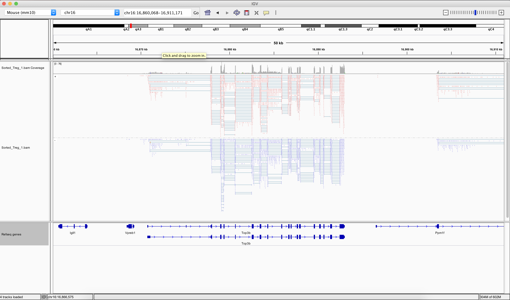
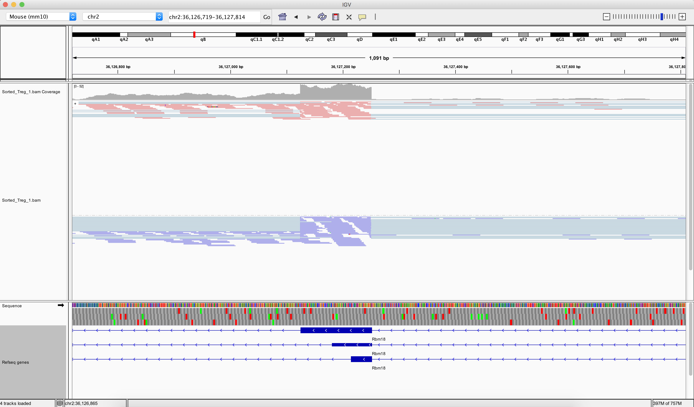
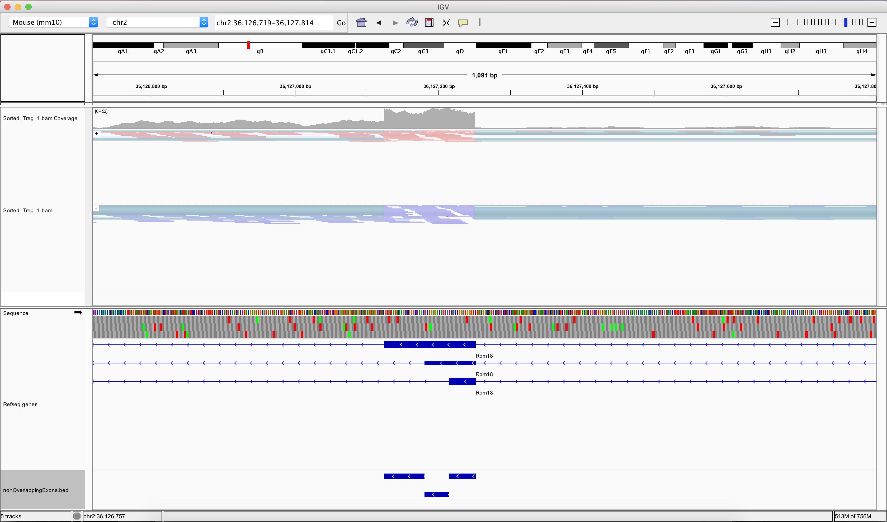

```{r setup, include=FALSE}
knitr::opts_chunk$set(echo = TRUE)
AsSlides <- TRUE
```

## RNA-seq

RNA-seq offers a method to simulateously measure the genome wide expression of annotated and novel transcripts.
<div align="center">

</div>

---
## RNA-seq for differential gene expression

A common goal in RNA-seq is to identify genes and/or transcripts which are expressed at differing levels between our user defined sample groups.

Absolute quantification of the expression level of gene is subject to measurement biases (GC bias in PCR and/or RNA capture/selection) so it is most appropriate to compare the levels of the expression of same gene across conditions than to compare differing genes' expression levels within a condition. 

This commonly referred to as differential gene or transcript expression (DGE/DTE).

<div align="center">

</div>

---
## RNA-seq for differential transcript usage

A less frequent but important goal in RNAseq is to identify any changes in the relative abundance of transcripts for a gene between conditions. This may be able to identify changes in a genes' functional role between conditions. i.e. One isoform of a protein may bind and activate, another may simply bind and obstruct other active forms. We call this differential transcript usage (DTU).

<div align="center">

</div>
---
## The data.

In this session we will be reviewing data from Christina Leslie's lab at MSKCC on T-Reg cells. This can be found on the Encode portal [here](https://www.encodeproject.org/experiments/ENCSR486LMB/)

FastQ for TReg RNAseq replicate 1 used in this session can be downloaded [here](https://www.encodeproject.org/files/ENCFF332KDA/@@download/ENCFF332KDA.fastq.gz)

FastQ for TReg RNAseq replicate 2 used in practical can be downloaded [here](https://www.encodeproject.org/files/ENCFF070QMF/@@download/ENCFF070QMF.fastq.gz)

For differential splicing and transcript analysis we will use one of our datasets from a splicing factor Knockdown RNAseq experiment found at GEO [here](https://www.ncbi.nlm.nih.gov/geo/query/acc.cgi?acc=GSE101763).

---
## What we will cover.

In the RNAseq sessions we will identify differential gene expression between our T-cell sample groups as well identify potential differential transcript usage. We will further identify biological functions associated with genes and visualise these in IGV and in summary plots.

We will also identify differentially used transcript and exons from our splice factor dataset and visualise these in IGV.

In our first session we will look at two separate ways we can gain gene expression estimates from raw sequencing data as fastQ files.

---
# Working with raw RNAseq data.

Once we have the raw fastQ data we can use the [ShortRead package](https://bioconductor.org/packages/release/bioc/html/ShortRead.html) to review our sequence data quality.

We have reviewed how to work with raw sequencing data in the [**FastQ in Bioconductor** session.](https://rockefelleruniversity.github.io/Bioconductor_Introduction/r_course/presentations/slides/FastQInBioconductor.html#1)


```{r shortreada,include=FALSE}
library(ShortRead)
library(ggplot2)
```

---
# Working with raw RNAseq data.

We can subsample from a fastQ file using functions in **ShortRead** package.

Here we use the [**FastqSampler** and **yield** function](https://rockefelleruniversity.github.io/Bioconductor_Introduction/r_course/presentations/slides/FastQInBioconductor.html#40) to randomly sample a defined number of reads from a fastQ file. Here we subsample 1 million reads.

```{r tregFQ1,cache=TRUE}
library(ShortRead)
fqSample <- FastqSampler("~/Downloads/ENCFF332KDA.fastq.gz",n=10^6)
fastq <- yield(fqSample)
fastq
```

---
# Working with raw RNAseq data.

Now we have our ShortRead object we can produce some of our more informative plots of fastQ properties.

First we can extract the read sequences, using the **sread()** function, and retrieve a matrix of base pair abundance over sequencing cycles (or length of read) using the **alphabetByCycle()** function.

```{r tregFQ2,cache=TRUE,dependson="tregFQ1",fig.height=3,fig.width=7}
readSequences <- sread(fastq)
readSequences_AlpbyCycle <- alphabetByCycle(readSequences)
readSequences_AlpbyCycle[1:4,1:4]
```

---
# Working with raw RNAseq data.

We can plot the abundance of DNA bases (A,C,G,T) over the length of read to see any biases.

```{r tregFQ3,cache=TRUE,dependson="tregFQ2",fig.height=3,fig.width=7}
library(ggplot2)
AFreq <- readSequences_AlpbyCycle["A",]
CFreq <- readSequences_AlpbyCycle["C",]
GFreq <- readSequences_AlpbyCycle["G",]
TFreq <- readSequences_AlpbyCycle["T",]
toPlot <- data.frame(Count=c(AFreq,CFreq,GFreq,TFreq),
                     Cycle=rep(1:50,4),
                     Base=rep(c("A","C","G","T"),each=50))
ggplot(toPlot,aes(y=Count,x=Cycle,colour=Base))+geom_line()+theme_bw()
```


---
# Working with raw RNAseq sequence data.

We can extract information on reads quality scores using the **quality()** function and translate this into a useful score summary per read using the **alphabetScore()** function.

We plot the distribution of quality scores to identify whether low quality reads should be filtered.

```{r tregFQ4,cache=TRUE,dependson="tregFQ1",fig.height=2,fig.width=7}
readQuality <- quality(fastq)
readQualityScores <- alphabetScore(readQuality)

toPlot <- data.frame(ReadQ=readQualityScores)
ggplot(toPlot,aes(x=ReadQ))+geom_histogram()+theme_minimal()
```

---
# Working with raw RNAseq sequence data.

A final essential check of fastq quality is to plot the quality of sequencing over the length of the read (and so over time). Here we can use the **as(MYQUALITIES,"matrix")** function to translate our ASCI encoded scores into numeric values and create a boxplot for visualisation.

```{r tregFQ55,cache=TRUE,dependson="tregFQ1",fig.height=5,fig.width=7}
qualAsMatrix <- as(readQuality,"matrix")
boxplot(qualAsMatrix[1:10000,])
```

---
# Aligning RNAseq reads

Following assessment of read quality, we will want to align our reads to the genome taking into account splice junctions.

Since RNAseq reads will not all align continously agaist our reference genome but will map across splice junctions we will use [our splice aware aligners we have seen in previous sessions.](https://rockefelleruniversity.github.io/Bioconductor_Introduction/r_course/presentations/slides/AlignmentInBioconductor.html#6) The resulting BAM file will contain aligned sequence reads for use in further analysis.

<div align="center">

</div>

---
# Creating a reference genome.

First we need to retrieve the sequence information for the genome of interest in [FASTA format](https://rockefelleruniversity.github.io/Genomic_Data/genomicFileFormats.html#/6)

We can use the [BSgenome libraries to retrieve the full sequence information.](https://rockefelleruniversity.github.io/Bioconductor_Introduction/r_course/presentations/slides/SequencesInBioconductor.html#4)

For the mouse mm10 genome we load the package **BSgenome.Mmusculus.UCSC.mm10**.

```{r fa1q, include=FALSE}
library(BSgenome.Mmusculus.UCSC.mm10)
library(TxDb.Mmusculus.UCSC.mm10.knownGene)
```

```{r fa1, echo=TRUE}
library(BSgenome.Mmusculus.UCSC.mm10)
BSgenome.Mmusculus.UCSC.mm10
```

---
# Creating a reference genome.

We will only use the major chromosomes for our analysis so we may exclude random and unplaced contigs.
Here we cycle through the major chromosomes and create a [**DNAStringSet** object from the retrieved sequences](https://rockefelleruniversity.github.io/Bioconductor_Introduction/r_course/presentations/slides/SequencesInBioconductor.html#22).

```{r fa2,cache=FALSE,echo=TRUE}
mainChromosomes <- paste0("chr",c(1:19,"X","Y","M"))
mainChrSeq <- lapply(mainChromosomes,
                     function(x)BSgenome.Mmusculus.UCSC.mm10[[x]])
names(mainChrSeq) <- mainChromosomes
mainChrSeqSet <- DNAStringSet(mainChrSeq)
mainChrSeqSet
```

---
# Creating a reference genome.

Now we have a **DNAStringSet** object we can use the [**writeXStringSet** to create our FASTA file of sequences to align to.](https://rockefelleruniversity.github.io/Bioconductor_Introduction/r_course/presentations/slides/SequencesInBioconductor.html#23)

```{r fa3, echo=TRUE,eval=FALSE}
writeXStringSet(mainChrSeqSet,
                "BSgenome.Mmusculus.UCSC.mm10.mainChrs.fa")
```


---
# QuasR RNA-seq alignment - Sample table

We can align our raw sequence data in fastQ format to the new FASTA file of our mm10 genome sequence using the **QuasR** package.

As we have seen in previous sessions, [the QuasR package requires a sample table to specify alignment files.](https://rockefelleruniversity.github.io/Bioconductor_Introduction/r_course/presentations/slides/AlignmentInBioconductor.html#13)

The sample table requires is a tab-delimited file listing the path to fastq(s) to be aligned and the desired sample names.

```{r sampleTable1, echo=TRUE,eval=FALSE}
FileName <- "~/Downloads/ENCFF332KDA.fastq.gz"
SampleName <- "Treg_1"
sampleTable <- data.frame(FileName,SampleName)
write.table(sampleTable,file="sampleTable.txt",sep="\t",
            quote=FALSE,row.names = FALSE)
```

```{r sampleTable1s, echo=FALSE,eval=TRUE}
FileName <- "~/Downloads/ENCFF332KDA.fastq.gz"
SampleName <- "Treg_1" 
data.frame(FileName,SampleName)
```

---
# QuasR splice-aware with BSGenome object

We can now align our data by using the **qAlign()** function.

The **qAlign()** function requires the path to our sample table file and the path of a FASTA file to align sequence reads against.

A major difference now compared to aligning ChIP-seq and ATAC-seq is we now set the parameter **splicedAlignment** to TRUE to allow us to map to/over splice junctions.

```{r bsgenome, echo=TRUE,eval=FALSE}
library(QuasR)
qAlign("sampleTable.txt","BSgenome.Mmusculus.UCSC.mm10.mainChrs.fa",
       splicedAlignment=TRUE)
```

---

# Aligning RNAseq reads with Rsubread.

The **Rsubread** package offers a faster aligner than the QuasR package although the **Rsubread** package is only available on Mac OS and Linux.

As for ChIP-seq and ATAC-seq alignment with the **Rsubread** package we must first build our genome index for Rsubread using the **buildindex()** function.

The [**buildindex()** function simply takes the parameters of our desired index name and the FASTA file to build index from.](https://rockefelleruniversity.github.io/Bioconductor_Introduction/r_course/presentations/slides/AlignmentInBioconductor.html#39)


```{r index, echo=TRUE,eval=FALSE}
library(Rsubread)
buildindex("BSgenome.Mmusculus.UCSC.mm10.mainChrs",
           "BSgenome.Mmusculus.UCSC.mm10.mainChrs.fa")
```

---
# Aligning RNAseq reads with Rsubread.

Having constructed our index, we can align our reads using the **Rsubread** package's **subjunc()** function.

The [**subjunc()** function requires arguments for the index to align to, the fastQ to align and the name of output BAM](https://rockefelleruniversity.github.io/Bioconductor_Introduction/r_course/presentations/slides/AlignmentInBioconductor.html#41)

```{r rsalign, echo=TRUE,eval=FALSE}
subjunc("BSgenome.Mmusculus.UCSC.mm10.mainChrs",
      "/Users/tcarroll//Downloads/ENCFF332KDA.fastq.gz",
      output_file="Treg_1.bam")
```

---
# Aligning RNAseq reads with Rsubread.

We can provide a GTF to our Rsubread call. Although largely unnecessary for gene expression estimation, this will allow us to capture non-canonical splice sites.

We simply need to provide a gtf to **annot.ext** parameter and set **useAnnotation** and **isGTF** to TRUE.

```{r rsalignTF, echo=TRUE,eval=FALSE}
subjunc("BSgenome.Mmusculus.UCSC.mm10.mainChrs",
      "/Users/tcarroll//Downloads/ENCFF332KDA.fastq.gz",
      output_file="Treg_1.bam",
      useAnnotation = TRUE,
      annot.ext = "TxDb.Mmusculus.UCSC.mm10.knownGene.gtf",
      isGTF=TRUE
      )
```


---

# Sort and index reads.

As before, we sort and index our files using the [**Rsamtools** packages **sortBam()** and **indexBam()** functions respectively.](https://rockefelleruniversity.github.io/Bioconductor_Introduction/r_course/presentations/slides/AlignedDataInBioconductor.html#10)

The resulting sorted and indexed BAM file is now ready for use in external programs such as IGV as well as for further downstream analysis in R.

```{r sortindex, echo=TRUE,eval=FALSE}
library(Rsamtools)
sortBam("Treg_1.bam","Sorted_Treg_1")
indexBam("Sorted_Treg_1.bam")
```

<div align="center">

</div>

---
## Counting in gene models

With our newly aligned reads it is now possible to assign reads to genes in order to quantify a genes' expression level (as reads) within a sample. 

First we need to gather our gene models of exons and splice junctions which we can use in our later counting steps.

```{r gm, echo=TRUE,eval=TRUE,cache=TRUE}
library(TxDb.Mmusculus.UCSC.mm10.knownGene)
geneExons <- exonsBy(TxDb.Mmusculus.UCSC.mm10.knownGene,by="gene")
class(geneExons)
```

---
## Counting in gene models

Now we have our GRangesList with each entry corresponding to a gene and within each entry a GRanges object of the genes' exons.

```{r gm2,echo=TRUE,eval=TRUE,cache=TRUE,dependson="gm"}
geneExons[1:2]
```

---
## Counting in gene models

We can now use the **summarizeOverlaps()** to [count the reads in our BAM that overlap genes](). We specify a BamFile object using the **BamFile()** function and specifying the **yieldSize** parameter to 10000  to control memory footprint.

The resulting **RangedSummarizedExperiment** object containing our counts and **GRanges** object.

```{r gm3,echo=TRUE,eval=TRUE,cache=TRUE,dependson="gm"}
library(GenomicAlignments)
myBam <- BamFile("Sorted_Treg_1.bam",yieldSize = 10000)
tregGeneCounts <- summarizeOverlaps(geneExons,myBam,
                                    ignore.strand = TRUE)
tregGeneCounts
```

---
## Counting in exons models

If want to start to evaluate differential transcript usage we will often evaluate counts over exons and assess for changes in exon usage.

<div align="center">

</div>

---
## Counting in exons models

To count over exons however we will encounter an issue of assigning reads to overlapping exons.

<div align="center">

</div>

---
## Counting in exons models

We can then work to differentiate exons by collapsing exons to the nonoverlapping, disjoint regions.

<div align="center">

</div>


---
## Counting in exons models

We can use the GenomicFeatures' package's **disjointExons()** function with our TxDb object, TxDb.Mmusculus.UCSC.mm10.knownGene, to extract a GRanges of our disjoint exons with their associated **gene_id**,**tx_name**,**exonic_part** in the metadata columns.

We add some sensible names to our GRanges for use in later steps.

```{r em2,echo=TRUE,eval=TRUE,cache=TRUE,dependson="em"}
library(GenomicFeatures)
nonOverlappingExons <- disjointExons(TxDb.Mmusculus.UCSC.mm10.knownGene)
names(nonOverlappingExons) <- paste(mcols(nonOverlappingExons)$gene_id,
                                    mcols(nonOverlappingExons)$exonic_part,
                                    sep="_")
nonOverlappingExons[1:3,]
```

---
## Counting in exons models

We can now again use the **summarizeOverlaps()** function with our nonOverlapping, disjoint exons to identify a BAM file of interest.

We need to set the **inter.feature** to FALSE to allow us to count reads overlapping multiple features (such as a read spanning between two exons).

```{r em3,echo=TRUE,eval=TRUE,cache=TRUE,dependson="em2"}
tregExonCounts <- summarizeOverlaps(nonOverlappingExons,
                                    myBam,
                                    ignore.strand = TRUE,
                                    inter.feature=FALSE)
```

---
## Counting in exons models

Now  can review our counts from our gene-level and exon-level counting. 

We retrieve a matrix of counts from either **RangedSummarizedExperiment** object using the **assay()** function.

```{r em4,echo=TRUE,eval=TRUE,cache=TRUE,dependson=c("em2","gm3")}
geneCounts <- assay(tregGeneCounts)
exonCounts <- assay(tregExonCounts)
head(exonCounts,2)
head(geneCounts,2)
```

---
## Transcript quantification.

More recently methods have developed to directly quantify transcript abundance from fastq files using k-mer counting. 

k-mer counting offers a super fast method of gaining transcript abundance estimates but do not produce a genomic alignment so not so useful for visualisation. 

As we are most often interested in gene expression changes this offers a fast alternative to counting for alignment and counting.

The two leading softwares for k-mer counting

* [Salmon](http://salmon.readthedocs.io/en/latest/) - Relationship with DESeq2.
 
* [Kallisto](https://pachterlab.github.io/kallisto/about). - History of splice aware aligners and transcript quantification.

---
## Salmon.

Salmon is the latest in a set of k-mer counting tools from the Kingsford lab (Jellyfish and Sailfish) and offers a workflow for transcript quantification from fastq raw seqeuncing data and a fasta file of transcript sequences.

Source code is available for all systems and binaries available for Macs and Linux [at their github.](https://github.com/COMBINE-lab/salmon/releases). Docker images available [here](https://combine-lab.github.io/salmon/getting_started/#obtaining-salmon)


---
## Reference for transcript quantification.

First we need to produce a FASTA file of transcript sequences. We can use the GenomicFeatures' packages **extractTranscriptSeqs** function to retrieve a DNAstringSet object of transcript sequences using our sequence data from **BSgenome.Mmusculus.UCSC.mm10** and gene models from **TxDb.Mmusculus.UCSC.mm10.knownGene** object.

```{r sal1,echo=TRUE,eval=TRUE,cache=TRUE}
allTxSeq <- extractTranscriptSeqs(BSgenome.Mmusculus.UCSC.mm10,
                      TxDb.Mmusculus.UCSC.mm10.knownGene,
                      use.names=TRUE)
allTxSeq
```

---
## Reference for transcript quantification.

With our new DNAstringSet object of transcript sequences we can write a FASTA file for use in Salmon with the **writeXStringSet** function.

```{r sal2,echo=TRUE,eval=TRUE,cache=TRUE,dependson="sal1"}
writeXStringSet(allTxSeq,
                "mm10Trans.fa")
```


---
## Salmon index from R.

As with standard aligners, the first part of our quantification requires us to make an index from our FASTA file using the **Salmon index** command. We specify the transcript fasta file (-t) and index name (-i).

Here we arrange our Salmon command into a system call from R to allow us to loop through files. 

```{}
~/bin/salmon index -i mm10Trans -t mm10Trans.fa
```

```{r salI_1,echo=TRUE,eval=FALSE,cache=TRUE,dependson="sal1"}
salmonExec <- "~/bin/salmon index"
fastaTx <- "mm10Trans.fa"
indexName <- "mm10Trans"
salmonIndexCmd <- paste(salmonExec,
                        "-i",indexName,
                        "-t",fastaTx)
salmonIndexCmd
system(salmonIndexCmd,wait = TRUE)
```


```{r salI_1a,echo=FALSE,eval=TRUE,cache=TRUE,dependson="sal1"}
salmonExec <- "~/bin/salmon index"
fastaTx <- "mm10Trans.fa"
indexName <- "mm10Trans"
salmonIndexCmd <- paste(salmonExec,
                        "-i",indexName,
                        "-t",fastaTx)
salmonIndexCmd
```

---
## Salmon quant from R.

To quantify transcript abundance we use the **Salmon quant** command. *For Mac* [we may need to specify a library location as seen here](https://combine-lab.github.io/salmon/getting_started/#obtaining-salmon). 

We specify the index location (-i), the reads to quantify (-r), the output directory (-o) and the library type as automatic detection of type (-l A).
```{}
~/bin/salmon quant -i mm10Trans -r ~/Downloads/ENCFF332KDA.fastq.gz -o TReg_1_Quant -l A
```

```{r salQ_1,echo=TRUE,eval=FALSE,cache=TRUE,dependson="sal1"}
salmonExec <- "~/bin/salmon quant"
fq <- "~/Downloads/ENCFF332KDA.fastq.gz"
outDir <- "TReg_1_Quant"
salmonQuantCmd <- paste(salmonExec,
                        "-i",indexName,
                        "-r",fq,
                        "-o",outDir,
                        "-l A")
salmonQuantCmd
system(salmonIndexCmd,wait = TRUE)
```


```{r salQ_1a,echo=FALSE,eval=TRUE,cache=TRUE,dependson="sal1"}
salmonExec <- "~/bin/salmon quant"
fq <- "~/Downloads/ENCFF332KDA.fastq.gz"
outDir <- "TReg_1_Quant"
salmonQuantCmd <- paste(salmonExec,
                        "-i",indexName,
                        "-r",fq,
                        "-o",outDir,
                        "-l A")
salmonQuantCmd
```
---
## Salmon outputs.

The output from Salmon is our quantification of transcripts in the **quant.sf** file in the user defined output directory.

We will use a new package **tximport** to handle these counts in next session but for now we can review file in standard R libraries.


```{r salReadIn,echo=TRUE,eval=FALSE,cache=TRUE}
myQuant <- read.delim("~/Downloads/TReg_1_Quant/quant.sf")
myQuant[1:3,]
```

```{r salReadIn2,echo=FALSE,eval=TRUE,cache=TRUE}
myQuant <- read.delim("~/Projects/Results/RNAseqPipeTest/FirstTest/counts/GM12878_1//quant.sf")
myQuant[1:3,]
```
---

# Time for an exercise.

[Link_to_exercises](../../Exercises/RNAseq_part1_exercises.html)

[Link_to_answers](../../Answers/RNAseq_part1_answers.html)

