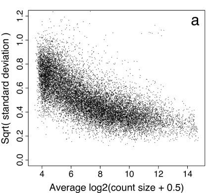
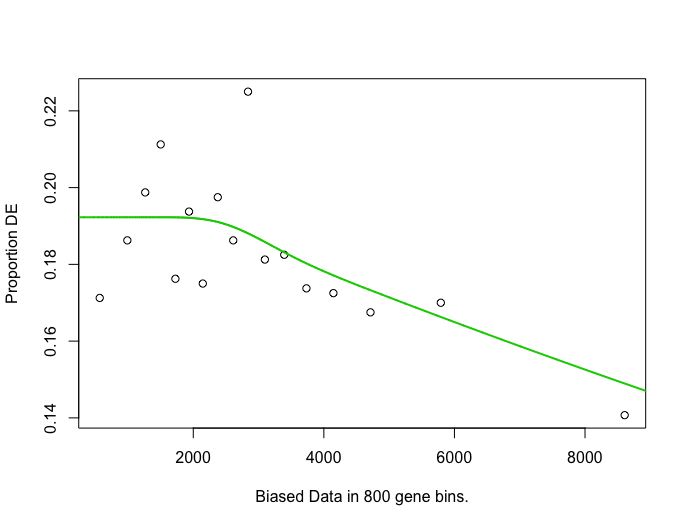

```{r setup, include=FALSE}
knitr::opts_chunk$set(echo = TRUE)
AsSlides <- TRUE
library(TxDb.Mmusculus.UCSC.mm10.knownGene)
library(GenomicAlignments)
library(DESeq2)
library(tximport)
library(org.Mm.eg.db)
library(goseq)
```

## The data.

In this session we will be reviewing data from Christina Leslie's lab at MSKCC on T-Reg cells and activated T-Reg cells. T-Reg data can be found on the Encode portal [here](https://www.encodeproject.org/experiments/ENCSR486LMB/) and activated T-Reg data [here](https://www.encodeproject.org/experiments/ENCSR726DNP/)

I have aligned all FQ to BAM and counted in genes and exons using Rsubread and summariseOverlaps().

I have also quantified our transcripts from FQ files using our transcript fasta from last session and Salmon.

---
## The data.

All Gene and Exon counts can be found as .RData obects in **Data** directory

- Counts in genes can be found at - **Data/GeneCounts.RData**
- Counts in disjoint exons can be found at - **Data/ExonCounts.RData**

- Salmon transcript quantification output directories can be found under - **Data/Salmon/**

---
## What we will cover.

In our last session we will looked at two separate ways we can gain gene expression estimates from raw sequencing data as fastQ files.

In this session we will import our expression estimates to identify differences in the expression of genes between conditions. 

---
## Counts from SummariseOverlaps

In our last session we counted our reads in genes using the summarise overlaps function to generate our **RangedSummarizedExperiment** object.

I have counted using a **BamFileList** of all T-Reg samples to easily organise my samples and save memory with the **yieldSize** parameter.

```{r eval=FALSE,echo=TRUE}
library(Rsamtools)
bamFilesToCount <- c("Sorted_Treg_1","Sorted_Treg_2",
                     "Sorted_Treg_act_1","Sorted_Treg_act_2",
                     "Sorted_Treg_act_3")
myBams <- BamFileList(bamFilesToCount,yieldSize = 10000)

```

---
## Counts from SummariseOverlaps

With this BamFileList I can count as we did a single sample to produce our **RangedSummarizedExperiment** object of counts in genes across all samples.

```{r eval=FALSE,echo=TRUE}
library(TxDb.Mmusculus.UCSC.mm10.knownGene)
library(GenomicAlignments)
geneExons <- exonsBy(TxDb.Mmusculus.UCSC.mm10.knownGene,by="gene")
geneCounts <- summarizeOverlaps(geneExons,myBams,
                                    ignore.strand = TRUE)
geneCounts
```

```{r gC1,eval=TRUE,echo=FALSE,cache=TRUE}
load("../../Data/GeneCounts.RData")
geneCounts
```

---
## Speeding up SummariseOverlaps

Bioconductor has a simple, unified system for parallisation through the **BiocParallel** package. The BiocParallel package allows for differing parallel approachs including multiple cores on the same machine and distributed computing across large cluster environments.

Simply by installing and loading library, we are ready for parallelisation.

```{r bp,eval=FALSE,echo=TRUE,cache=TRUE}
library(BiocParallel)
```

---
## Speeding up SummariseOverlaps

We can control the parallisation in BiocParallel often choosing either a serial mode (no parallisation) with **SerialParam()** function or the number of cores to use with **MulticoreParam(workers=NUMBEROFCORES)**. 

We use the **register()** function to set the desired parallelisation.

```{r bp1,eval=FALSE,echo=TRUE,cache=TRUE,dependson="bp"}
paramMulti <- MulticoreParam(workers=2)
paramSerial <- SerialParam()
register(paramSerial)
```

---
## Counts from SummariseOverlaps

Our **RangedSummarizedExperiment** contains our counts as a matrix accessible by the **assay()** function.

Each row is named by its Entrez gene ID.


```{r gC2,eval=TRUE,echo=TRUE,cache=TRUE,dependson="gC1"}
assay(geneCounts)[1:2,]
```
---
## Counts from SummariseOverlaps

We can retrieve the GRangesList we counted by the **rowRanges()** accessor function.

Each GRangesList element contains exons used in counting, has Entrez gene ID and is in matching order as rows in our count table.


```{r gC3,eval=TRUE,echo=TRUE,cache=TRUE,dependson="gC1"}
rowRanges(geneCounts)[1:2,]
```

---
## Differential expression from RNAseq data.

To perform differential expression between our sample groups we will need to perform some essential steps.

- Transform and/or Normalise our counts.

- Calculate significance of differences between groups from normalised/transformed counts.


---
## Log transform or as counts.

Two broadly different approaches to RNAseq analysis could be. 

- Log2 transform, normalise, use standard test for normal distribution to find differential expression.

- Normalise and use test suitable for count data to find differential expression.


---
## Mean and variance relationship.

Most approaches seek to model the relationship between mean expression and variance of expression in order to model and shrink variance of individual genes. This will assist us to detect differential expression with a small number of replicates.




---
## DESeq2

Although options for differential expression are available in R including DESeq2, EdgeR and Voom/Limma.


Both EdgeR and DESeq2 works with unnormalised/non-transformed countdata to detect differential expression.

Voom transforms count data into log2 transformed values with associated mean dependent weighting for use in Limma differential expression functions.

We will use the DESeq2 software to identify differential expression.

---
## DESeq2

To use DESeq2 we must first produce a dataframe of our Sample groups.

```{r de1,eval=TRUE,echo=TRUE,cache=TRUE,dependson="gC1"}
metaData <- data.frame(Group=c("Naive","Naive","Act","Act","Act"),
                       row.names = colnames(geneCounts))
metaData
```


---
## DESeq2

Previously we have been using **DESeqDataSetFromMatrix()** constructor.

We must provide the counts matrix, our metadata dataframe, our design specifying with metadata columns to test and a GRanges we counted on.


```{r de22,eval=TRUE,echo=TRUE,cache=TRUE,dependson="de1"}
countMatrix <- assay(geneCounts)
countGRanges <- rowRanges(geneCounts)
dds <- DESeqDataSetFromMatrix(countMatrix,
                              colData = metaData,
                              design = ~Group,
                              rowRanges=countGRanges)
dds
```


---
## DESeq2

Alternative, can first update our **RangedSummarizedExperiment** object to include our metadata using the **colData** accessor.

```{r de2,eval=TRUE,echo=TRUE,cache=TRUE,dependson="de1"}
colData(geneCounts)$Group <- metaData$Group
geneCounts
```

---
## DESeq2

Now we can make use of the  **DESeqDataSet()** function to build directly from our **RangedSummarizedExperiment** object.

We simply have to specify the **design** parameter to specify metadata column to test on.

```{r de3,eval=TRUE,echo=TRUE,cache=TRUE,dependson="de1"}
dds <- DESeqDataSet(geneCounts,design = ~Group)
dds
```

---
## DESeq function

We have previously used the **DEseq()** workflow function to normalise library sizes, estimate and shrink variance and test our data in a single step.

```{r de4,eval=TRUE,echo=TRUE,cache=TRUE,dependson="de3"}
dds <- DESeq(dds)
```


---
## DESeq function

In its first step the  **DEseq()** function normalises our data by evaluating the median expression of genes across all samples to produce a per sample normalisation factor (library size). 

We can retrieve normalised and unnormalised values from our DESeq2 object using the **counts()** function and specifying the **normalized** parameter as TRUE. Normalised counts are counts divided by the the calculated library size.

```{r de5,eval=TRUE,echo=TRUE,cache=TRUE,dependson="de4"}
normCounts  <- counts(dds,normalized=TRUE)
normCounts[1:2,]
```

---
## DESeq function

In the second step the **DEseq()** function estimates variances and importantly shrinks variance depending on the mean. This shrinking of variance allows us to detect significant changes with low replicate number.

We can review the Variance/mean relationship and shrinkage using **plotDispEsts()** function and our **DESeq2** object. We can see the <span style="color:blue">**adjusted dispersions in blue**</span> and <span style="color:black">**original dispersion for genes in black**</span>.
```{r de6,eval=TRUE,echo=TRUE,cache=TRUE,dependson="de4",fig.width=8,fig.height=4.5}
plotDispEsts(dds)
```

---
## DESeq results

Finally we can extract our contrast of interest using the **results()** function.

We must specify the **contrast** parameter, listing the metadata column of interest and the two groups to compare.

The resulting **DESeqResults** can be sorted by pvalue to list most significant changes at top of table.


```{r de7,eval=TRUE,echo=TRUE,cache=TRUE,dependson="de4"}
myRes <-results(dds,contrast = c("Group","Act","Naive"))
myRes <- myRes[order(myRes$pvalue),]
myRes[1:3,]
```

---
## DESeqResults objects

The **DESeqReults** object contains important information from our differential expression testing.

- **baseMean** - Mean normalised values across all samples.
- **log2FoldChange** - Log2 of fold change between groups being compared.
- **pvalue** - Significance of change between groups.
- **padj** - Significance of change between groups corrected for multiple testing.

---
## DESeqResults objects

With our DESeqResults object We can get a very quick overview of differential expression changes using the **summary** function.

```{r dr1,eval=TRUE,echo=TRUE,cache=TRUE,dependson=c("de7")}
summary(myRes)
```

---
## DESeqResults objects

We can review the relationship between fold-changes and expression levels with a MA-Plot by using the **plotMA()** function and our DESeqResults object. 

```{r dr1a,eval=TRUE,echo=TRUE,cache=TRUE,dependson=c("de7"),fig.height=4,fig.width=7}
plotMA(myRes)
```

---
## DESeqResults objects

We downweight genes with high fold change but low significance by using the **lfcShrink()** function as we have the **results()** function.  This allows us to know use the log2FC as a measure of significance of change in our ranking for analysis and in programs such as **GSEA**.

```{r dr1b,eval=TRUE,echo=TRUE,cache=TRUE,dependson=c("de7"),fig.height=4,fig.width=7}
myRes <-results(dds,contrast = c("Group","Act","Naive"))
myRes$log2FoldChange <- lfcShrink(dds,contrast = c("Group","Act","Naive"))
plotMA(myRes)
```

```{r dr1c,eval=TRUE,echo=FALSE,cache=TRUE,dependson=c("dr1b")}
myRes <-results(dds,contrast = c("Group","Act","Naive"))
```

---
## DESeqResults objects

We can also convert our DESeqResults objects into a standard data frame using the **as.data.frame** function.

```{r dr2,eval=TRUE,echo=TRUE,cache=TRUE,dependson=c("de7")}
myResAsDF <- as.data.frame(myRes)
myResAsDF[1:2,]
```

---
## DESeqResults objects - NA in padj

By default DEseq2 filters out low expressed genes to assist in multiple testing correction. This results in **NA** values in **padj** column for low expressed genes.

```{r dr22a,eval=TRUE,echo=TRUE,cache=TRUE,dependson=c("de7")}
table(is.na(myResAsDF$padj))
```

---
## DESeqResults objects - NA in padj

We can add a column of our own adjusted p-values for all genes with a pvalue using the **p.adjust()** function. 

```{r dr22b,eval=TRUE,echo=TRUE,cache=TRUE,dependson=c("de7")}
myResAsDF$newPadj <- p.adjust(myResAsDF$pvalue)
myResAsDF[1:3,]
```

---
## DESeqResults objects - NA in padj

Typcially genes with **NA** padj values should be filtered from the table for later evaluation and functional testing.

```{r dr22,eval=TRUE,echo=TRUE,cache=TRUE,dependson=c("de7")}
myResAsDF <- myResAsDF[!is.na(myResAsDF$padj),]
myResAsDF[1:3,]
```

---
## DESeq2 from Salmon.

We saw at the end of last session how we can gain transcript quantification from fastQ using Salmon.

Salmon offers a super fast alternative to alignment and counting for transcript expression estimation so we would be keen to make use of this in our differential expression analysis.

To make use of Salmon transcript quantifications for differential gene expression changes we must however summarise our transcript expression estimates to gene expression estimates.

---
## Tximport 

The tximport package, written by same author as DESeq2, offers functions to import data from a wide range of transcript counting and quantification softwares and summarise transcript expression to genes.

We can first load the Bioconductor tximport package.

```{r tx1,eval=TRUE,echo=TRUE,cache=TRUE,dependson="de4"}
library(tximport)
```

---
## Tximport 

In order to summarise our transcripts to genes we will need to provide a data.frame of transcripts to their respective gene names.

First we read in a single salmon quantification report to get a table containing all transcript names.

```{r tx2,eval=TRUE,echo=TRUE,cache=TRUE,dependson="tx1"}
temp <- read.delim("../../Data/Salmon/T_reg_1/quant.sf")
temp[1:3,]
```

---
## Tximport 

We can now use the **select()** function to retrieve a transcript names (TXNAME) to gene ids (GENEID) map from our TxDb.Mmusculus.UCSC.mm10.knownGene object. 

Remember that available columns and keys can be found using the **columns()** and **keytype** functions respectively.

```{r tx3a,eval=TRUE,echo=TRUE,cache=TRUE,dependson="tx2"}

Tx2Gene <- select(TxDb.Mmusculus.UCSC.mm10.knownGene,
                  keys = as.vector(temp[,1]),
                  keytype = "TXNAME",
                  columns = c("TXNAME","GENEID"))
```


---
## Tximport 

Now we can use the **tximport** function to import and summarise our Salmon quantification files to gene level expression estimates.

We must provide the paths to Salmon *quant.sf* files, the type of file to import (here "salmon") to **type** argument and our data.frame of transcript to gene mapping using the **tx2gene** arguement.

```{r tx4,eval=TRUE,echo=TRUE,cache=TRUE,dependson="tx3a"}
salmonQ <- dir("../../Data/Salmon/",recursive = T,
               pattern = "quant.sf",full.names = T)
salmonCounts <- tximport(salmonQ,
                         type="salmon",
                         tx2gene = Tx2Gene)
```

---
## Tximport 

The result from tximport is a list containing our summarised gene expression estimates

**Abundance** - Number Transcripts per million transcripts.(TPM) 
**Counts** - Estimated counts.


```{r tx5,eval=TRUE,echo=TRUE,cache=TRUE,dependson="tx4"}
salmonCounts$abundance[1:2,]
salmonCounts$counts[1:2,]
```

---
## DESeq2 from Tximport 

We can now use the **DESeqDataSetFromTximport()** to build our DESeq2 object from salmon counts. We must specify the metadata to **colData** parameter and specify the column of interest in **design** parameter as we have done for **DESeqDataSetFromMatrix()**.

```{r tx6,eval=TRUE,echo=TRUE,cache=TRUE,dependson="tx5"}
ddsSalmon <- DESeqDataSetFromTximport(salmonCounts,
                                      colData = metaData,
                                      design = ~Group)
```


---
## DESeq2 from Tximport 

We can then proceed as we did for previous analysis using summarizeOverlaps counts.

```{r tx7,eval=TRUE,echo=TRUE,cache=TRUE,dependson=c("tx6"),message=FALSE,warning=FALSE}
ddsSalmon <- DESeq(ddsSalmon)
myResS <-results(ddsSalmon,contrast = c("Group","Act","Naive"))
myResS <- myResS[order(myResS$pvalue),]
myResS[1:3,]
```

---
## Salmon and alignment/summarizeOverlaps. 

We can now compare the differential following Salmon quantificiation and alignment/summarizeOverlaps.

The vast majority of differentials are found to be in common. Those differing are from typically close to significance cut-offs.

```{r dr1ss,eval=TRUE,echo=FALSE,cache=TRUE,dependson=c("tx7","de7")}
swde <- merge(as.data.frame(myRes),as.data.frame(myResS),by=0)

toCompare <- cbind(swde$padj.x < 0.05 & !is.na(swde$padj.x) & !is.na(swde$padj.y),swde$padj.y < 0.05 & !is.na(swde$padj.y) & !is.na(swde$padj.x))
colnames(toCompare) <- c("summarizeOverlaps","Salmon")
limma::vennDiagram(toCompare)
```


---
## Annotation of results table.

By whatever method we have chose to analyse of differential expression we will want to add some sensible gene names or symbols to our data frame of results.

We can use the **org.db** packages to retrieve Gene Symbols for our Entrez ids using the **select** function. Here we use the **org.db** package for mouse, **org.db**

```{r anno,eval=TRUE,echo=TRUE,cache=TRUE,dependson=c("tx7","de7"),message=FALSE,warning=FALSE}
library(org.Mm.eg.db)
eToSym <- select(org.Mm.eg.db,
                 keys = rownames(myResAsDF),
                 keytype = "ENTREZID",
                 columns="SYMBOL")
eToSym[1:10,]
```


---
## Annotation of results table.

Now we can merge the Entrez ID to Symbol table into our table of differential expression results.

```{r anno2,eval=TRUE,echo=TRUE,cache=TRUE,dependson="anno"}
annotatedRes <- merge(eToSym,myResAsDF,
                      by.x=1,
                      by.y=0,
                      all.x=FALSE,
                      all.y=TRUE)
annotatedRes <- annotatedRes[order(annotatedRes$pvalue),]
annotatedRes[1:3,]
```

---
## Functional Enrichment analysis.

Following differential analysis it is a common step to identify any changes in groups of genes sharing a common biological function.

We can use the GOseq package to identify any functional enrichment in our differentially expressed genes.

The GOseq package requires a named vector of 1s or 0s indicating whether a gene is upregulated/downregulated. 

Here we define a set of genes significantly upregulated in Activated vs Naive T-reg cells (padj <0 05 and log2FC > 1).

```{r func,eval=TRUE,echo=TRUE,cache=TRUE,dependson="anno2"}
UpInAct <- annotatedRes$padj < 0.05 & 
             annotatedRes$log2FoldChange > 0
UpInAct <- as.integer(UpInAct)
names(UpInAct) <- annotatedRes$ENTREZID
table(UpInAct)
```


---
## Functional Enrichment analysis.

The **GOseq** package is specifically designed to account for potential length biases in differential expression analysis and so can remove any artefactual enrichment for long and short genes.

The **nullp** function assess any biases by evaluating the relationship between differential expression and length. 

```{r func1,eval=FALSE,echo=TRUE,cache=FALSE,dependson="func"}
library(goseq)
pwf = nullp(UpInAct, "mm10", "knownGene", plot.fit = TRUE)
```

<div align="center">

</div>
---
## Functional Enrichment analysis.

Having corrected for any bias we can now use the **goseq** function to for enrichment of GO or KEGG terms.

We must specify the genome build and ID we are using (here matching our TxDb.UCSC.**mm10**.**knownGene**.db) and the categories we wish to test (GO:BP,GO:MF,GO:CC,KEGG). 

Here we identify the top enriched functional terms in GO biological processes.
```{r funca,eval=TRUE,echo=FALSE,cache=TRUE,include=FALSE}
load(file="../../Data/fit.RData")
```

```{r func2,eval=TRUE,echo=TRUE,cache=TRUE,dependson="funca",warning=FALSE,message=FALSE}
GO_UpInAct <- goseq(pwf,"mm10","knownGene",
                       test.cats=c("GO:BP"))
GO_UpInAct[1:3,]
```

---
## Retrieving function groups.

We can retrieve the genes in the **immune response (GO:0006955)** functional group using the **select** and the **org.Mm.eg.db** object.

We then filter our DE table and write to file.

```{r func3,eval=TRUE,echo=TRUE,cache=TRUE,dependson="funca",warning=FALSE,message=FALSE}
library(org.Mm.eg.db)
ImmuneResponseGenes <- select(org.Mm.eg.db,keytype = "GOALL",
                              keys = "GO:0006955",columns = "ENTREZID")
IRG_Entrez <- unique(ImmuneResponseGenes$ENTREZID)

IRG_Res <-  annotatedRes[annotatedRes$ENTREZID %in% IRG_Entrez,]
write.table(IRG_Res,
            file="ImmuneResponseGeneTable.csv",sep=",",
            row.names = FALSE)
```

---

```{r include=FALSE,eval=FALSE}

library("edgeR")
library("DESeq2")
countsFiles <- dir("~/../../Volumes/Untitled/RNAseq_Report/counts/",full.names=T,pattern="*Gene.Counts")
#do.call(cbind,list(countsFiles))
ans <- list()
rownamesToBe <- read.delim(countsFiles[1],sep="\t",h=T)[,1]
for(i in 1:length(countsFiles)){
  ans[[i]] <- read.delim(countsFiles[i],sep="\t",h=T)[,2]
  
}
fullCounts <- do.call(cbind,ans)
rownames(fullCounts) <- rownamesToBe
colnames(fullCounts) <- gsub("_subread_Gene.Counts","",basename(countsFiles))
library(TxDb.Mmusculus.UCSC.mm10.knownGene)
csc <- exonsBy(TxDb.Mmusculus.UCSC.mm10.knownGene,by = "gene")
csc <- csc[na.omit(rownames(fullCounts),match(names(csc)))]
geneCounts <- SummarizedExperiment(assays = fullCounts,rowRanges=csc)


library("edgeR")
library("DESeq2")
countsFiles <- dir("~/../../Volumes/Untitled/RNAseq_Report/counts/",full.names=T,pattern="*Gene.ExonCounts")
#do.call(cbind,list(countsFiles))
ans <- list()
rownamesToBe <- read.delim(countsFiles[1],sep="\t",h=T)[,1]
for(i in 1:length(countsFiles)){
  ans[[i]] <- read.delim(countsFiles[i],sep="\t",h=T)[,2]
  
}
fullCounts <- do.call(cbind,ans)
rownames(fullCounts) <- rownamesToBe
colnames(fullCounts) <- gsub("_subread_Gene.ExonCounts","",basename(countsFiles))

GRangesced <- matrix(unlist(strsplit(read.delim(countsFiles[1],sep="\t",h=T,stringsAsFactors = FALSE)[,2],"_")),ncol=3,byrow=T)
dwpd <- GRanges(seqnames=GRangesced[,1],IRanges(as.numeric(GRangesced[,2]),as.numeric(GRangesced[,3])))
newnames <- gsub("\\.","_",gsub("X","",make.names(read.delim(countsFiles[1],sep="\t",h=T)[,1],unique=TRUE)))
newnames[-grep("_",newnames)] <- paste0(newnames[-grep("_",newnames)],"_0")
csc  <- as.data.frame(matrix(unlist(strsplit(newnames,"_")),ncol=2,byrow=T),stringsAsFactors=FALSE)
csc[,2] <- as.numeric(as.vector(csc[,2]))+1
rownames(fullCounts) <- paste(csc[,1],csc[,2],sep="_")

exonCounts <- SummarizedExperiment(assays = fullCounts,rowRanges=dwpd)
mcols(dwpd) <- data.frame(gene_id=gsub("_.*","",rownames(exonCounts)),
                           tx_name=paste0("TX",gsub("_.*","",rownames(exonCounts))),
                           exonic_part=gsub(".*_","",rownames(exonCounts))
                           )
exonCounts <- SummarizedExperiment(assays = fullCounts,rowRanges=dwpd)
colData(exonCounts)$Group <- c("Naive","Naive","Act","Act","Act")


colDatts <- data.frame(Group=c("Naive","Naive","Act","Act","Act"),
                       row.names = colnames(exonCounts))

rownames(fullCounts)  <- NULL
exonCounts <- SummarizedExperiment(assays = fullCounts,rowRanges=dwpd)
colData(exonCounts)$Group <- c("Naive","Naive","Act","Act","Act")

tekk <- DEXSeqDataSetFromSE(exonCounts,design= ~ sample + exon + Group:exon)
tekk = estimateSizeFactors(tekk)
tekk = estimateDispersionsGeneEst(tekk)
tekk = testForDEU(tekk)


```


---

# Time for an exercise.

[Link_to_exercises](../../Exercises/RNAseq_part2_exercises.html)

[Link_to_answers](../../Answers/RNAseq_part2_answers.html)

